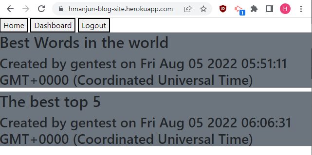
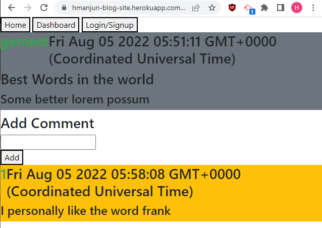

# Blog Site

## Description

This application creates a full stack blog site that has a front end component to visualize posts and comments as well as a backend to store users and all the posts and comments they make. Feautes of this application include users being able to login and logged in users being able to create posts or leave comments on other posts.

This application uses sql and sequelize for its backend which is ran on an express server and uses handlebars for html template building to improve SEO. 

## Deployed Link

[Heroku site](https://hmanjun-blog-site.herokuapp.com/)

## Working Project

### Home-Page

### Post-Page

## Startup
Click on the login/signup button to automatically login to a test account in the database.
This gives access to creating comments on a post.

Without needing to login, you can click on a post on the homepage to view the full post and any comments it has.

## Deployed Link

[Heroku site](https://hmanjun-blog-site.herokuapp.com/)

## License
 

Licensed under the [MIT](https://opensource.org/licenses/MIT) license

## Questions
Contact me via email at hmanjun@ucsc.edu
View my other projects on [github](github.com/hmanjun) 